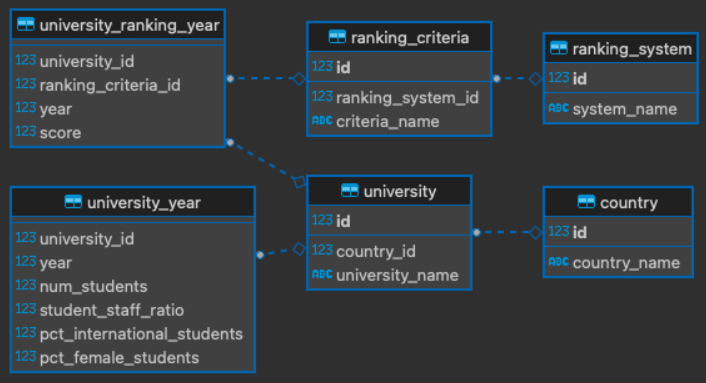

# Universidades Net

Universidades webapp built in using Microsoft Entity Framework in C#

## References

Universidades UML class diagram:



## Prerequisites

- SDK .Net 7 Installed

## Getting started

To start project follow these steps:

1- Clone Github Project:

```
git clone https://github.com/jorgeabrahan/agenda_net.git
```

2- Navigate to project folder:

```
cd agenda_net
```

3- Compose docker running:

```
docker compose up --build
```

Run:

```
dotnet run
```
